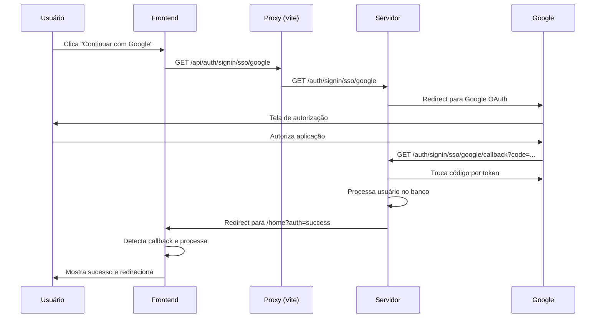

# Guia de Integração - Google OAuth Frontend

## Implementação Concluída

### ✅ Serviços de Autenticação

**Arquivo:** `src/services/auth-service/auth-services.js`
- Adicionada função `initiateGoogleLogin()` que redireciona para o endpoint de autenticação

**Arquivo:** `src/services/auth-service/UseAuthProvider.js`
- Adicionada função `loginWithGoogle()` no provider
- Implementada detecção automática de callback do Google (query params)
- Tratamento de sucesso (`?auth=success`) e erro (`?error=auth_failed`)

### ✅ Interface de Login

**Arquivo:** `src/pages/sign-in.jsx`
- Botão "Continuar com o Google" agora é funcional
- Feedback visual para sucesso/erro de autenticação
- Limpeza automática de parâmetros da URL após callback

## Como Usar

### 1. Clique no Botão Google
O usuário clica em "Continuar com o Google" na tela de login.

### 2. Redirecionamento Automático
- Frontend → `window.location.href = "/api/auth/signin/sso/google"`
- Vite proxy → `http://server:8080/auth/signin/sso/google`
- Servidor → Redireciona para Google OAuth

### 3. Autorização no Google
O usuário autoriza a aplicação no Google.

### 4. Callback Automático
- Google → `http://localhost/login?auth=success` (sucesso)
- Google → `http://localhost/login?error=auth_failed` (erro)

### 5. Processamento Frontend
- Sucesso: Mostra mensagem e redireciona para `/home`
- Erro: Mostra mensagem de erro
- Limpa parâmetros da URL automaticamente

## Fluxo Técnico



## Estados do Frontend

### Durante Autenticação
- Botão Google fica desabilitado durante login normal
- Redirecionamento é instantâneo (não há loading state)

### Callback de Sucesso
- URL: `/?auth=success` ou `/login?auth=success`
- Mensagem: "Login com Google realizado com sucesso!"
- Ação: Redireciona para `/home` após 1.5s

### Callback de Erro
- URL: `/?error=auth_failed` ou `/login?error=auth_failed`
- Mensagem: "Erro na autenticação com Google. Tente novamente."
- Ação: Permanece na tela de login

### Limpeza de URL
- Parâmetros são removidos automaticamente via `window.history.replaceState()`
- URL fica limpa após processamento

## Configuração Necessária

### Variáveis de Ambiente (Backend)
```bash
GOOGLE_CLIENT_ID=seu_client_id
GOOGLE_CLIENT_SECRET=seu_client_secret
GOOGLE_REDIRECT_URI=http://localhost:8080/auth/signin/sso/google/callback
FRONTEND_URL=http://localhost
```

### Google Cloud Console
- Configurar URLs de redirect autorizadas:
  - Dev: `http://localhost:8080/auth/signin/sso/google/callback`
  - Prod: `https://seudominio.com/auth/signin/sso/google/callback`

## Comportamento do Sistema

### Novo Usuário
1. Usuário autoriza no Google
2. Sistema cria conta automaticamente
3. `auth_with_google = true`
4. Login automático com JWT cookie
5. Redirecionamento para `/home`

### Usuário Existente
1. Sistema encontra usuário por email
2. Vincula conta Google ao usuário existente
3. `auth_with_google = true`
4. Login automático
5. Redirecionamento para `/home`

### Segurança
- JWT armazenado em cookie `HttpOnly`
- Proxy Vite mantém cookies como first-party
- CORS configurado corretamente
- Tokens seguros em produção

## Debugging

### Logs Úteis
```javascript
// No useAuthProvider.js
console.warn("Falha ao verificar autenticação:", error.message);
```

### Verificar Configuração
1. Backend rodando em `http://server:8080`
2. Frontend rodando em `http://localhost`
3. Proxy Vite funcionando (`/api` → `server:8080`)
4. Variáveis de ambiente configuradas
5. Google Cloud Console configurado

### Possíveis Problemas

**Erro de CORS:**
- Verificar `ALLOWED_ORIGINS` no backend
- Confirmar proxy Vite configurado

**Redirect URI mismatch:**
- URLs no Google Console devem coincidir com `GOOGLE_REDIRECT_URI`

**Cookie não sendo definido:**
- Verificar se proxy mantém first-party cookies
- Confirmar configuração `sameSite` no backend

## Próximos Passos

1. ✅ Implementação frontend concluída
2. ✅ Integração com backend funcional
3. ✅ Tratamento de callbacks implementado
4. 🔄 Testar fluxo completo
5. 📝 Documentar qualquer ajuste necessário